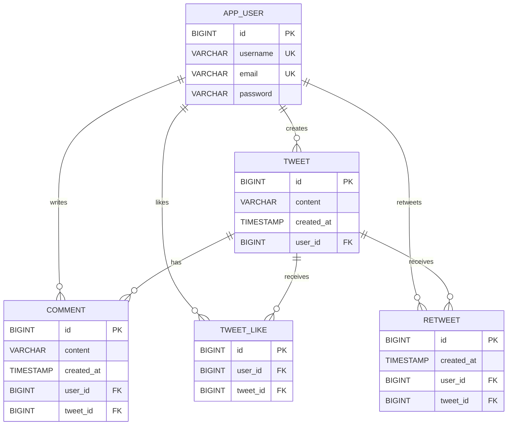

# Database ER Diagram

## Constraints

- `app_user.username` is unique.
- `app_user.email` is unique.
- `tweet_like` has a unique constraint on `(user_id, tweet_id)`.
- `retweet` has a unique constraint on `(user_id, tweet_id)`.